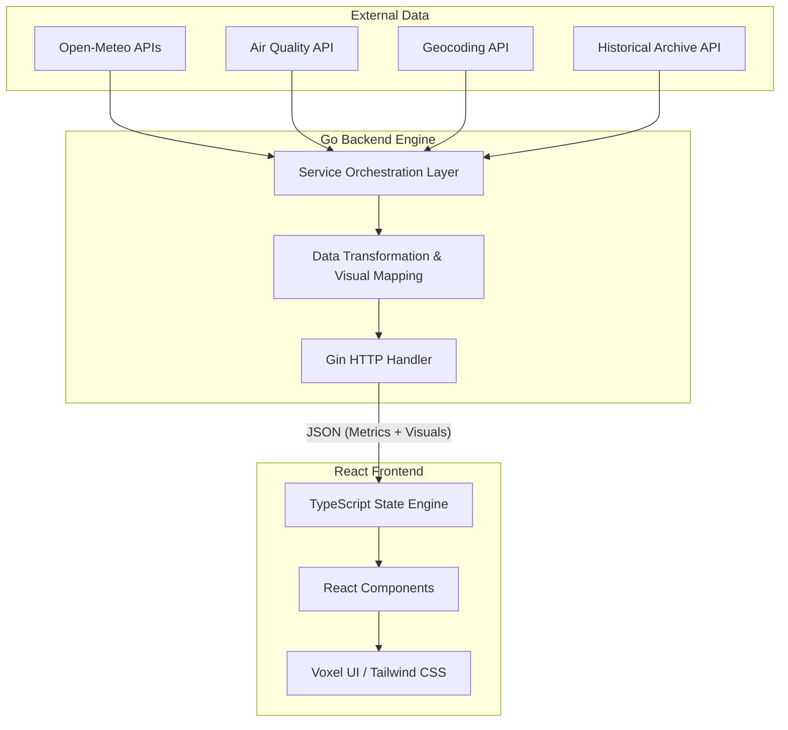

# ☁️ TEMPO-WEATHER: Voxel Weather Dashboard

A premium, high-performance environmental dashboard that combines a unique Minecraft-inspired aesthetic with professional-grade data science capabilities. Driven by a **Go backend** for maximum concurrency and a **React/TypeScript frontend** for a seamless user experience.

---

## 🏗️ Technical Architecture

The system is designed with a clear separation of concerns, optimized for real-time data streaming and processing:

### ⚙️ Backend: High-Performance Go Engine
- **Framework**: [Gin Gonic](https://gin-gonic.com/) for high-throughput HTTP routing.
- **Service Layer**: An asynchronous orchestration layer that interfaces with multiple Open-Meteo specialized APIs (Weather, Geocoding, Air Quality, Archive).
- **Transformation Logic**: On-the-fly data normalization and UI state mapping, ensuring the frontend only handles presentation while the backend owns the data contract.

### 🌐 Frontend: Dynamic Voxel Interface
- **Core**: React 18 with absolute type safety via TypeScript.
- **Styling**: A bespoke design system using Tailwind CSS and custom "Voxel" CSS tokens for pixel-coherent shadows, borders, and depth-aware animations.
- **State Engine**: Real-time interval polling and event-driven updates for location transitions.

---

## 🔬 Professional Data Science Integration

This project is engineered to be a robust platform for environmental data analysis, moving beyond simple weather reporting into the realm of data science.

### 📡 High-Resolution Data Sources
We utilize the **Open-Meteo API suite**, offering several key advantages for data scientists:
- **7km to 11km Resolution**: Access to high-resolution weather models that exceed the accuracy of standard commercial APIs.
- **Keyless Access**: Designed for reproducibility and open research without the friction of API rate-limiting tokens for initial analysis.
- **Multi-Source Fusion**: Aggregates data from global weather models (GFS, ICON, ECMWF) into a unified JSON format.

### 📊 Advanced Data Science Workflows
1.  **Historical Time-Series Retrieval**: The system is pre-configured to interface with historical archives, allowing users to pull up to 80+ years of weather data for baseline climate analysis.
2.  **Particulate & Gas Modeling**: Built-in support for Air Quality indices (PM2.5, PM10, CO, NO2, O3, SO2), essential for correlation studies between weather patterns and urban pollution.
3.  **Predictive Modeling Readiness**: The structured data output from our Go backend is ideal for ingestion into Python-based ML pipelines (Scikit-Learn, TensorFlow, PyTorch).
4.  **Geospatial Analysis**: Comprehensive geocoding integration allows for mapping environmental metrics to precise global coordinates.

---

## 🔍 The Data Model: `WeatherData`

Our internal data structure is optimized for both UI rendering and analytical processing:

| Field | Type | Significance for Research |
| :--- | :--- | :--- |
| `AvgTemp` | `string` | Calculated mean temperature for climate trend analysis. |
| `Rainfall` | `string` | Precise precipitation measurement in millimeters. |
| `AirDensity` | `string` | Derived metric for aerodynamic and meteorological modeling. |
| `UV` | `string` | Categorized index for environmental exposure studies. |
| `Humidity` | `int` | Relative humidity percentage for atmospheric analysis. |

---

## 🔄 Technical Flow

1.  **Ingestion**: Backend receives city/biome requests and resolves them to coordinates.
2.  **Processing**: Go service initiates concurrent calls to Open-Meteo's distributed API nodes.
3.  **Optimization**: Data is filtered, transformed, and mapped to voxel-themed visual properties (colors, shadows).
4.  **Delivery**: React frontend receives an optimized payload and triggers a synchronized UI re-render.

---

## 🚀 Deployment & Usage

### 🛠️ Prerequisites
- Go 1.21+
- Node.js 18+
- npm or bun

### 📡 Local Setup
1. **Launch Backend**: `cd backend && go run main.go`
2. **Launch Frontend**: `cd .. && npm install && npm run dev`
3. **Environment**: Configure `VITE_BACKEND_URL` in `.env` if using a custom port.

---

*Built with ❤️ for the Data Science community.*
